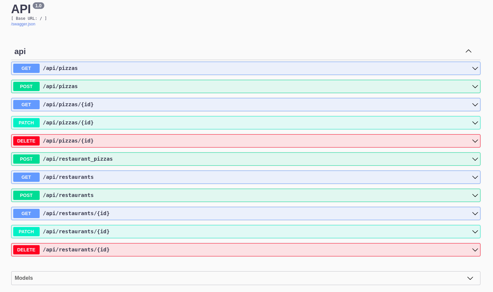

# Pizza Restaurants Flask API

## Phase 4 Week 1 : Flask Code Challenge

[](./LICENSE)


## Introduction

This is a Flask API that simulates a Pizza Restaurant domain.



## Features

- Create a restaurant
- Get all restaurants
- Find, update, or delete a restaurant by ID
- Create a pizza
- Get all pizzas
- Find, update, or delete a pizza by ID
- Create a new RestaurantPizza that is associated with an existing Pizza and Restaurant

## Installation

### 1. Clone the repository

```txt
git clone https://github.com/ArshavineRoy/pizza-restaurants-api
```

### 2. Navigate to the project's directory

```txt
cd pizza-restaurants-api
```

### 3. Install required dependencies

```python
pipenv install
```

- If `pipenv` is not already installed, you can do so using `pip`:

  ```python
  pip install pipenv
  ```

### 4. Activate the virtual environment

```python
pipenv shell
```

### 5. If needed, seed the database with

```python
python3 seed.py
```

### 6. Run the Flask server from the root directory

```python
python3 run.py
```

### 7. Use an API management tool e.g., `Postman` / `Insomnia` to make requests

## Usage

1. **POST/restaurants**

   Returns JSON data for the created restaurant in the format below:

   ```JSON
    [
      {
        "id": 1,
        "name": "Kilimanjaro Jamia",
        "address": "23 Banda Street, Nairobi"
      },
    ]
   ```

1. **GET/restaurants**

   Returns JSON data for restaurants in the format below:

   ```JSON
    [
      {
        "id": 1,
        "name": "Dominion Pizza",
        "address": "Good Italian, Ngong Road, 5th Avenue"
      },
      {
        "id": 2,
        "name": "Pizza Hut",
        "address": "Westgate Mall, Mwanzi Road, Nrb 100"
      }
    ]
   ```

1. **GET/restaurants/:id**

   Returns JSON data for the requested restaurant in the format below:

   ```JSON
     {
      "id": 1,
      "name": "Dominion Pizza",
      "address": "Good Italian, Ngong Road, 5th Avenue",
      "pizzas": [
        {
          "id": 1,
          "name": "Cheese",
          "ingredients": "Dough, Tomato Sauce, Cheese"
        },
        {
          "id": 2,
          "name": "Pepperoni",
          "ingredients": "Dough, Tomato Sauce, Cheese, Pepperoni"
        }
       ]
     }
   ```

1. **PATCH/restaurants/:id**

   Returns JSON data for the updated restaurant in the format below:

   - For example: `PATCH/restaurants/1` to update address from 23 to 25 Banda Street, Nairobi.

     PATCH request:

     ```JSON
       [
         {
           "name": "Kilimanjaro Jamia",
           "address": "231 Banda Street, Nairobi"
         },
       ]
     ```

     Response:

     ```JSON
       [
         {
           "id": 1,
           "name": "Kilimanjaro Jamia",
           "address": "231 Banda Street, Nairobi"
         },
       ]
     ```

1. **DELETE /restaurants/:id**

   Removes a restaurant from the database along with any RestaurantPizzas that are associated with it and returns an empty dictionary.

1. **POST/pizzas**

   Returns JSON data for the created pizza in the format below:

   ```JSON
    [
      {
        "id": 1,
        "name": "BBQ chicken",
        "ingredients": "Dough, Cheese, chicken"
      },
    ]
   ```

1. **GET /pizzas**

   Return JSON data for pizzas in the format below:

   ```JSON
   [
      {
        "id": 1,
        "name": "Hawaiian",
        "ingredients": "Dough, Tomato Sauce, Cheese"
      },
      {
        "id": 2,
        "name": "Pepperoni",
        "ingredients": "Dough, Tomato Sauce, Cheese, Pepperoni"
      }
    ]
   ```

1. **GET/pizzas/:id**

   Returns JSON data for the requested pizza in the format below:

   ```JSON
    [
      {
        "id": 1,
        "name": "BBQ chicken",
        "ingredients": "Dough, Cheese, chicken"
      },
    ]
   ```

1. **PATCH/pizzas/:id**

   Returns JSON data for the updated pizza in the format below:

   - For example: `PATCH/pizzas/1` to add `tomato sauce` ingredient.

     PATCH request:

     ```JSON
       [
         {
           "name": "BBQ chicken",
           "ingredients": "Dough, Cheese, chicken, tomato sauce"
         },
       ]
     ```

     Response:

     ```JSON
       [
         {
           "id": 1,
           "name": "BBQ chicken",
           "ingredients": "Dough, Cheese, chicken, tomato sauce"
         },
       ]
     ```

1. **DELETE /pizza/:id**

   Removes a pizza from the database along with any Restaurants or RestaurantPizzas that are associated with it and returns an empty dictionary.

1. **POST /restaurant_pizzas**

   Creates a new RestaurantPizza that is associated with an existing Pizza and Restaurant and returns JSON data for the pizza in the format below:

   ```JSON
   [
     {
       "id": 10,
       "name": "Hawaiian",
       "ingredients": "Dough, Tomato Sauce, Cheese"
     }
   ]
   ```

## Author & License

Authored by [Arshavine Waema](https://github.com/ArshavineRoy).

Licensed under the [MIT License](LICENSE) - see the [LICENSE](LICENSE) file for details.
